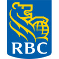

# Super - Full Stack Developer Intern  
- **Location:** Toronto, ON, Canada
- **Duration:** May 2023 - Aug 2023

### Achievements - Excellent Intern
- Reduced cost on transactions made on Super e-commerce shop by eliminating third-party handling of refund payments, saving Super 1% on refund transactions.
- Leveraged Redis caching for retrieving itineraries based on location to avoid re-fetching AI-generated text, decreasing user wait time by 5%.
- Added rate limiting to Flask API endpoints and validation-based registration to an internal web application tool to prevent servers from cyber-attacks and resource exhaustion using Flask-limiter and decorators.
- Increased unit testing of a complex code base by 15% by mocking function calls using Jest testing framework.
- Migrated experiment framework to Amplitude by successfully installing the Amplitude SDK in Next.js.

# SS&C Technologies - Full Stack Developer Intern 

- **Location:** Toronto, ON, Canada
- **Duration:** Sep 2022 - Dec 2022

### Achievements - Outstanding Intern
- Developed a Marketplace to sell Equity funds and Securities by architecting database structure and CRUD and RESTful APIs in Java.
- Integrated Kafka topics to asynchronously update databases and enabled idempotency to avoid duplicate messages, decreasing response time for all endpoints.
- Constructed GraphQL endpoints on top of the service layer to help clients fetch and query relevant and specific data, reducing client-side caching by 10%.
- Optimized JPA queries by avoiding Hibernate N+1 problem, saving fetch time on average by 30 seconds.

# Royal Bank of Canada - Full Stack Developer Intern  

- **Location:** Toronto, ON, Canada
- **Duration:** Jan 2022 - Apr 2022

### Achievements - Outstanding Intern
- Revamped AIOps micro-frontend user interface and integrated ML tools to expedite resolution of technical incidents, resulting in an estimated cost savings of $2.73 million for RBC by 2024.
- Cut client-side loading by reducing the size of data for each endpoint with pagination in a Flask Micro Back-end.
- Worked in biweekly sprints by talking to stakeholders, holding retrospectives, and adapting to changes to achieve an MVP a week before the release date.

# Waterloop - Software Developer Team Member  

- **Location:** Waterloo, ON, Canada
- **Duration:** Sep 2021 - Jan 2022

### Achievements
- Automated task distribution from Google Docs to Click Up to decrease administration time by 10%.
- Utilized Google OAuth Tokens and relational database to authenticate users for improved security.
- Improved TeamHub login page by identifying UI bugs and swiftly fixing them using GitHub Version Control.

# Kenna Technologies Solutions Inc - BI SQL Developer Intern  

- **Location:** Mississauga, ON, Canada
- **Duration:** May 2021 - Aug 2021

### Achievements - Excellent Intern
- Implemented automated SQL queries to remove redundant data, decreasing run-time by 5% for all tables.
- Strategically created queries in Stored Procedure to effectively aggregate tables for data visualization reports.
- Delivered Tableau reports to clients in a fast-paced environment to help them make real-time business decisions.
