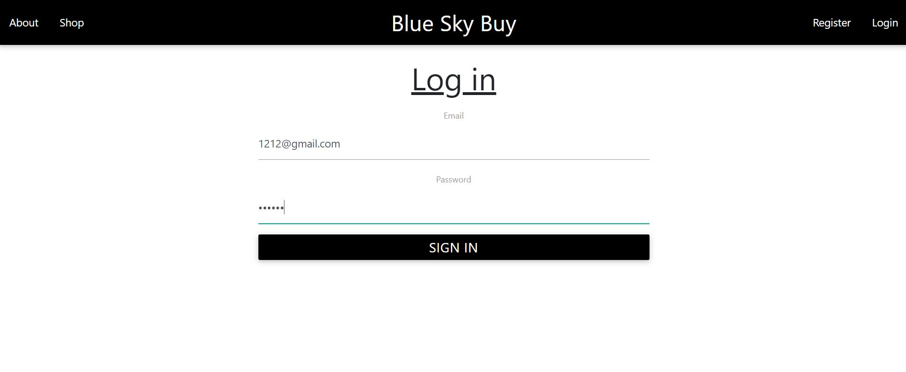

<head>
<meta charset="utf-8">
<!--<link rel="stylesheet" href="styles.css">-->

</head>
<body>
  <!-- 3 -->
 <h3 style="text-align:center;">
    <a href="https://github.com/harshgandhi29/Frontend-E-Commerce"> 
    <u>Crowd Buy Ecommerce Platform</u>
    </a>
  </h3>
  

    

   The project is a web application that offers user registration and login functionality, ensuring password security by hashing passwords and issuing JWT tokens upon successful login. Once logged in, users are directed to a main page with a modified navigation bar, giving them access to specific features. The primary feature is a shopping platform where users can view and purchase items listed by others. Additionally, users can add their own items to the platform for public sale. The application also emphasizes user-friendliness with a Materialize-styled interface and an 'add icon' button for adding items to the shopping platform. Overall, the project combines user authentication and a shopping experience in a well-designed web application.
       
       
  
  

   

      
   

  

  <!-- 2 -->

 <h3 style="text-align:center;">
    <a href="https://github.com/harshgandhi29/twitter-emotion-bot"> 
    <u>Twitter Sentiment Anlysis Bot</u>
    </a>
  </h3>
  

    

    The project started out with the goal of finding setiment around business announcements, in replies to their social media posts. However, the possibilities were endless when the ml model was created. After creating it, I realized it was fun for trolling around. Thus, application was containerized and hosted live, listening for twitter mentions 24/7. The bot analyzes the tweet under which it was called (@wahwahbot analyze), and returns the sentiment from the ML pipeline.
       
       
  

   

      
   

  

    <!-- 3 -->
  <h3 style="text-align:center;">
    <a href="https://github.com/Harshgandhi29/Mail-Bot"> 
    <u>Translating/Alerting Mail Bot</u>
    </a>
  </h3>
  

    

  This automated bot uses pyFirmata, email, and the Google API IMAP to send a signal to an LED powered by an Arduino when it detects an unseen email. It initializes the Arduino connection using Pyfirmata and sends a 0.5-volt signal to turn on an LED (0 for off, 1 for on). To ensure security, it stores the password in a text file and connects to the Gmail server with SSL. It includes features like a Tkinter interface, specific alerts for important email addresses, and the ability to read emails out loud and translate them into multiple languages, making it user-friendly for those with limited computer knowledge.
       
       
  

   

      
   

  

</body>

